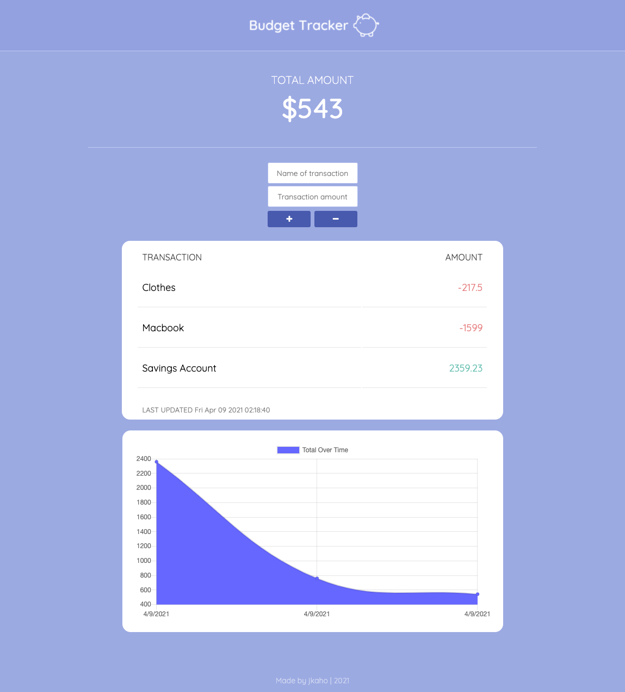
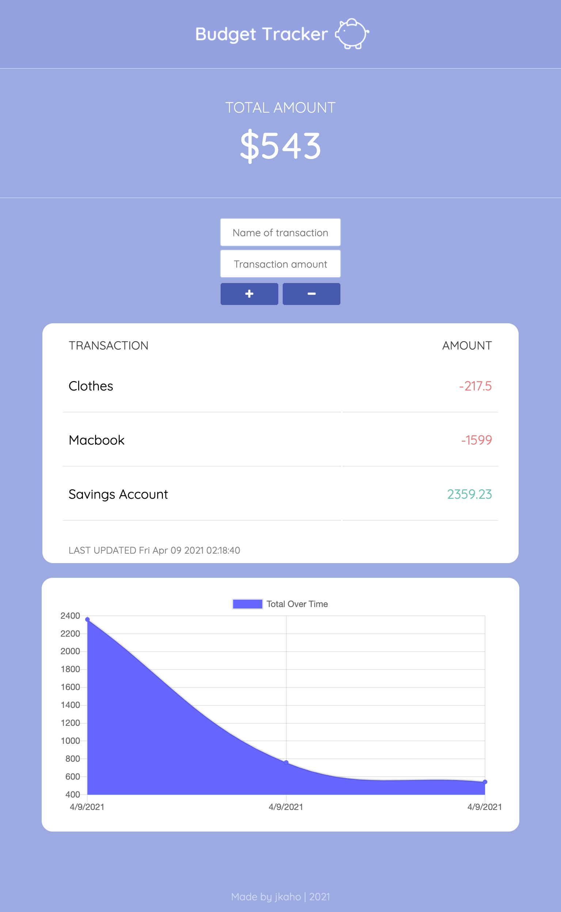
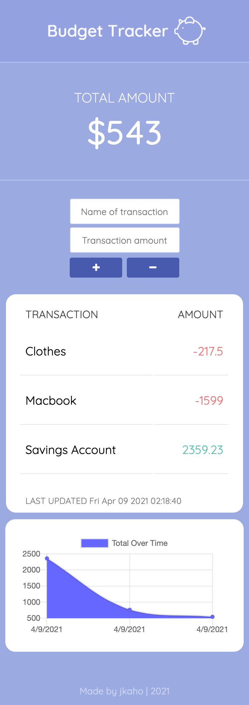

# Budget Tracker

## Description 

*Budget Tracker* is a full stack progressive web application (PWA) that allows users to keep track of their total funds. The application can be installed from the browser onto a user's desktop or mobile device for one-click access. In addition, for a seamless and convenient user experience, it is also fully functional offline. 

## Table of Contents

- [Motivations](#Motivations)
- [Technologies Used](#Technologies-Used)
- [Screenshots](#Screenshots)
- [Link to deployed application](#Link)
- [Questions](#Questions)

## Motivations 

This application was created with the objective to provide potential users with a simple yet convenient means by which to keep track of their spending.

Furthermore, it was created as a project to help solidify my understanding of progressive web apps through the implementation of the in-built Cache and IndexedDB web APIs. 

## Technologies Used

- Node.js / Express
- JavaScript 
- MongoDB / MongoDB Atlas
- Mongoose 
- IndexedDB API
- Service worker / Cache API
- npm compression package
- HTML / CSS
- Heroku

## Screenshots

### Large viewport 

### Medium viewport

### Small viewport

## Link

Link to deployed application: [jkaho-budget-tracker-herokuapp.com](https://jkaho-budget-tracker.herokuapp.com/)

## Questions

**My GitHub Profile:** [jkaho](https://github.com/jkaho)

If you have any further questions, feel free to email me at [j.h_7@yahoo.com](mailto:j.h_7@yahoo.com)
